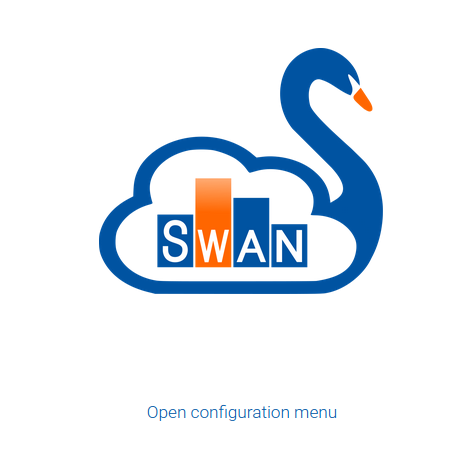
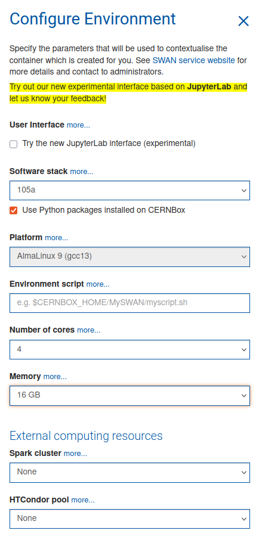
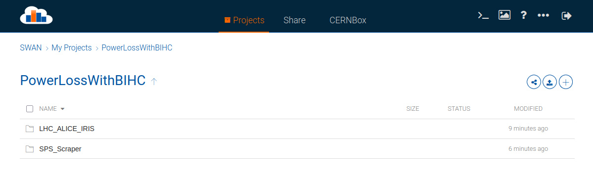
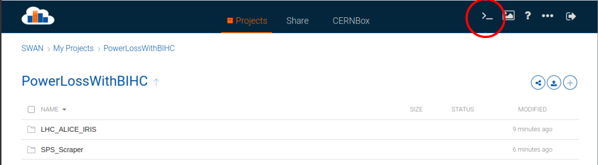

# Installation guide

This section explains how to set up the environment to start using BIHC package for power loss computations. For installing `pytimber` check the section *Installation with pytimber in CERN lxplus*. `pytimber` is also accesible from CERN SWAN python notebooks using the `102b NXCALS PRO` configuration.

<div class="warning">
<div class="admonition-title">
Warning
</div>
This documentation is currently under development
</div>

#### Developers: Download BIHC repository from Github
```
# SSH:
git clone git@github.com:ImpedanCEI/BIHC.git

# or HTTPS:
git clone https://github.com/ImpedanCEI/BIHC.git
```

#### Users: pip install 
```
pip install bihc
```
If already installed but want to have the newest version: `pip install bihc --upgrade`

### Installation with pytimber in CERN lxplus

Connect to CERN lxplus via ssh. Avoid connecting to lxplus8, the code will induce in Kerberos issues. Kerberos logging will expire 4h after each connection and needs to be renewed.
```
ssh -X user@lxplus.cern.ch
```
In your /user or /work directory, do:
```
# If miniconda is not installed
# Get, install and activate miniconda
wget https://repo.anaconda.com/miniconda/Miniconda3-latest-Linux-x86_64.sh
bash Miniconda3-latest-Linux-x86_64.sh 
source miniconda3/bin/activate

# Get standard packages 
# (to have all spark functionalities pandas needs to be installed before pytimber)
pip install numpy scipy matplotlib ipython pandas

# Change python package index to CERN index
pip install git+https://gitlab.cern.ch/acc-co/devops/python/acc-py-pip-config.git

# Install pytimber
pip install pytimber datascout

# Change python package index back to default
pip uninstall acc-py-pip-config
```
Test the installation with 
```
$ ipython
import pytimber
ldb = pytimber.LoggingDB(source="nxcals") 
ldb.search('LHC%BEAM_ENERGY%')
ldb.get(ldb.search('LHC%BEAM_ENERGY%')[0], t1='2022-06-15 15:10:30.0000')
```

## Guide to use BIHC on SWAN
> Guide to perform `bihc` calculations on CERN's SWAN notebook platform: https://swan-k8s.cern.ch




### Choosing the SWAN environment
The recommended setup is 4 cores 16 Gb to speed up calculations. Remember to check :ballot_box_with_check: the `Use Python packages installed on CERNBox` option to be able to use `bihc`.


#### :warning: Accessing accelerator data from Timber
If one needs to access data from Timber, the correct Software stack would be `105a NXCALS PRO` that comes with `pytimber` pre-installed and has the SPARK environment mounted.

### Open the project
Select the project folder to open:



* If the project has been shared with you from SWAN, it will be in the `Share` tab and you will have to `clone` it to your personal project to be able to modify and run it.
* If you keep your project on your personal CERNBox (not shares), you can access it on the `CERNBox` and modify it without needing to clone it.

### Install `BIHC` and other needed packages
Packages can be installed directly from a notebook cell by using `!` as first character. The notebook will interprete it as a terminal (bash) command. 
```python
!pip install bihc
```
Packages installed this way will be stored in your `CERNBox/.../.local/` path and will be accesible to the notebook kernel only if the checkbox :ballot_box_with_check: `Use Python packages installed on CERNBox` has been checked when creating the environment.

Another option is to open a terminal:



This will give you access to the linux terminal of your kernel environment. There one can simple write `pip install bihc` to install the package and also access the files and python from the terminal.


